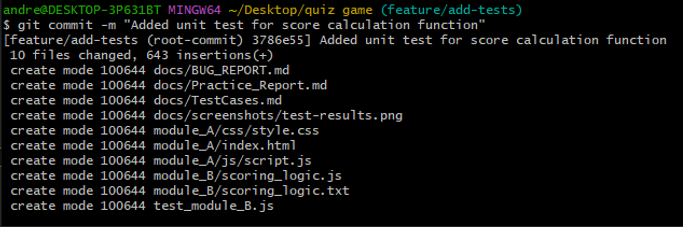
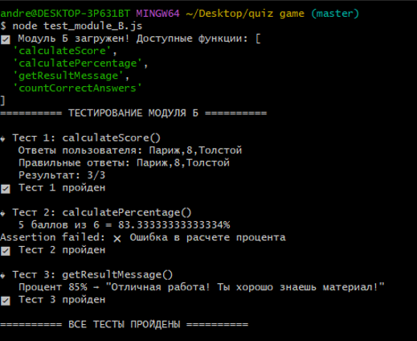

# Отчет по практике ПП.02.01

## Ссылки
- Репозиторий: https://github.com/user22818/practice-pm02-integration-testing
- Issue: https://github.com/user22818/practice-pm02-integration-testing/issues/1
- Pull Request: https://github.com/user22818/practice-pm02-integration-testing/pull/1

## Скриншоты
### Граф коммитов

### Результат выполнения тестов

## Тест-кейсы
Разработано 5 тест-кейсов для модуля подсчета баллов:
- TC-001: calculateScore() ✅
- TC-002: calculatePercentage() ✅
- TC-003: getResultMessage(85%) ✅
- TC-004: getResultMessage(100%) ✅
- TC-005: countCorrectAnswers() ✅

## Вывод
Все тесты пройдены успешно. Модуль Б работает корректно.